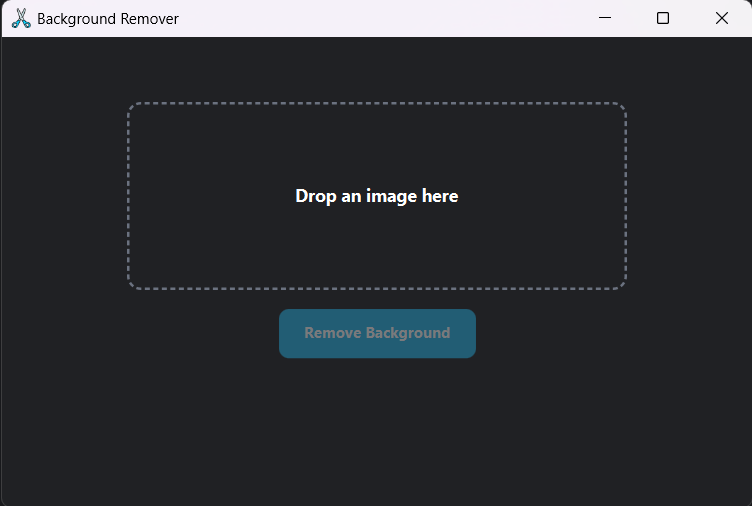

# Background Remover

A local desktop background-removal application built with JavaFX and Python in news of remove.bg being moved to Canvas.

If you clone the repo, do the following steps:

1. Install Python and add to PATH (if not already installed on computer)

2. Create virtual environment (Run in project root)
```python
python -m venv .venv
```

3. Activate the virtual environment
```bash
.venv\Scripts\activate
```

4. Install the required dependencies
```bash
pip install rembg pillow onnxruntime
```

5. Run application
```bash
mvn javafx:run
```


